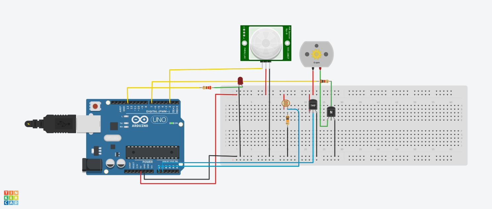

# SmartClass – Intelligent Classroom Energy Management System

SmartClass is an Arduino-based smart classroom system that automatically manages classroom lighting and ventilation based on **occupancy, brightness, and temperature**.

The system is designed to reduce unnecessary energy usage while maintaining a comfortable classroom environment.

## 🚀 Features

- 👤 **Occupancy Detection** using PIR sensor
- 💡 **Automatic Light Control** using LDR and LED
- 🌡️ **Temperature Monitoring** using TMP36
- 🌀 **Automatic Fan Control** based on temperature and occupancy
- 📊 **Serial Monitor Dashboard** for real-time classroom status
- ⚡ **Light and Fan Runtime Tracking** for energy usage monitoring

## 🛠️ Components Used

- Arduino Uno R3
- PIR Motion Sensor
- LDR (Light Dependent Resistor)
- TMP36 Temperature Sensor
- LED
- 220Ω Resistor
- 10kΩ Resistor
- DC Motor
- NPN Transistor
- 1kΩ Resistor
- Breadboard
- Jumper Wires

## 🔌 Pin Connections

| Component | Arduino Pin |
|---|---|
| PIR Signal | D2 |
| LED | D13 |
| LDR | A0 |
| TMP36 | A1 |
| Fan/Motor Control | D7 |

## 🔌 Circuit Diagram



## ⚙️ How It Works

### 1. Occupancy Detection
The PIR sensor detects whether a person is present in the classroom.

### 2. Smart Lighting
If a person is present and the classroom is dark, the LED automatically turns ON.

### 3. Smart Fan
If a person is present and the temperature reaches **28°C or above**, the fan automatically turns ON.

### 4. Dashboard
The Serial Monitor displays:

- Room status
- Temperature
- Light status
- Fan status
- Brightness value
- Light runtime
- Fan runtime

## 📊 Example Dashboard

```text
================================
     SMART CLASSROOM
================================
Room Status : OCCUPIED
Temperature : 30.25 C
Light       : ON
Fan         : ON
--------------------------------
ENERGY USAGE
--------------------------------
Light Used  : 15.00 seconds
Fan Used    : 10.00 seconds
================================
💡 Energy-Saving Logic

The system avoids unnecessary operation:

No person → Light OFF and Fan OFF
Person + dark room → Light ON
Person + bright room → Light OFF
Person + temperature ≥ 28°C → Fan ON
Person + temperature < 28°C → Fan OFF
💻 Technologies Used
Arduino
Embedded C/C++
Sensors and actuators
Tinkercad Circuits
Git & GitHub
🔮 Future Improvements
IoT-based web dashboard
Real-time energy consumption measurement
Mobile notifications
ESP32-based wireless monitoring
Automatic classroom scheduling
Historical energy usage analytics
👩‍💻 Project

SmartClass – Intelligent Classroom Energy Management System

Developed as a smart automation prototype for efficient classroom energy management.